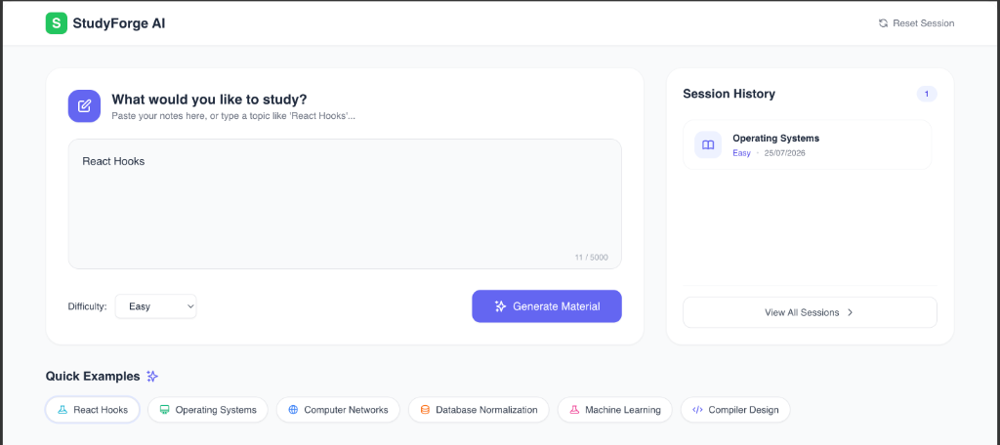
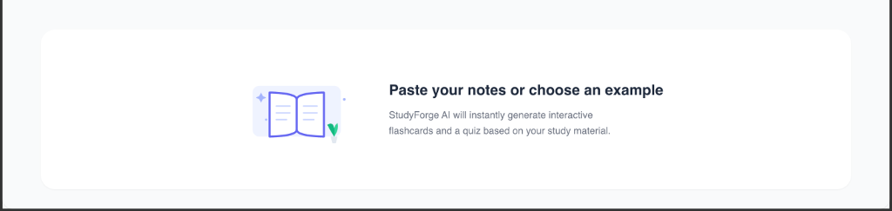
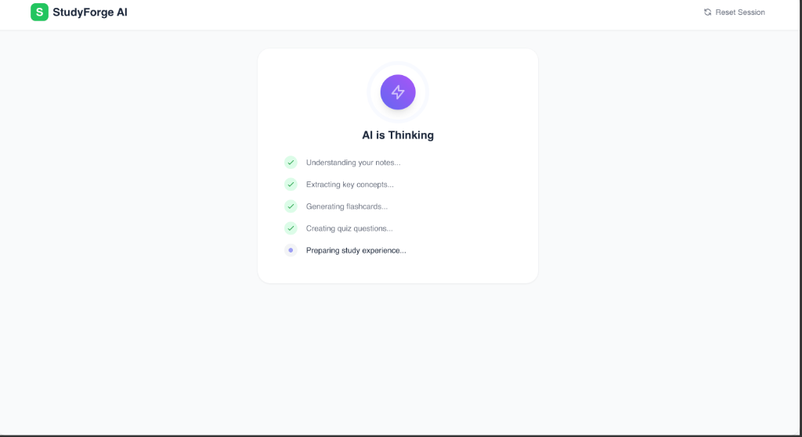
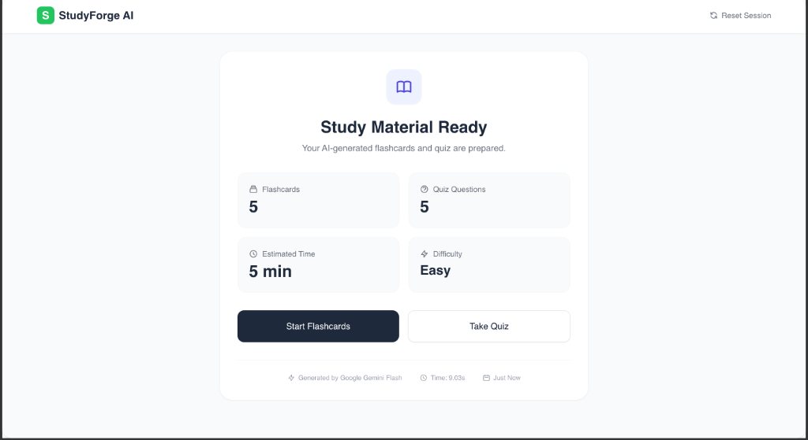
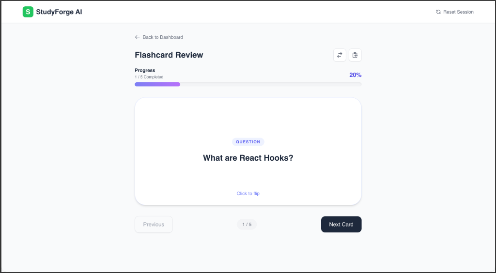
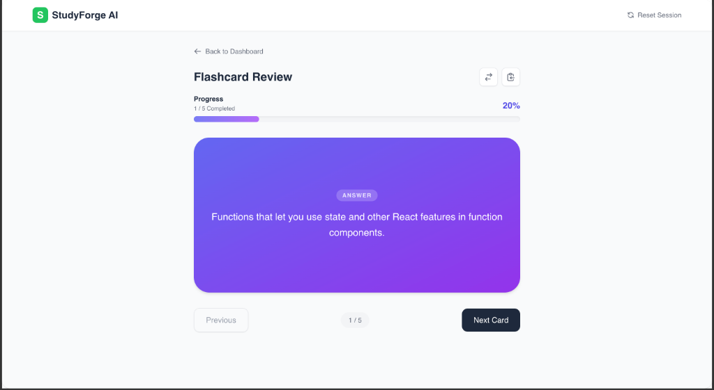
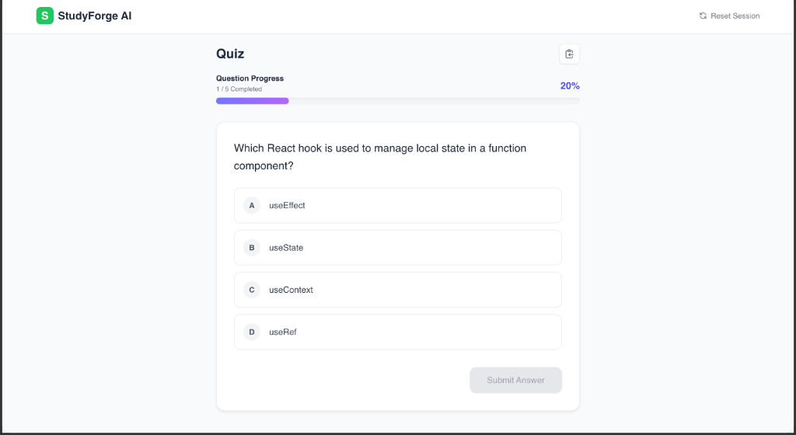
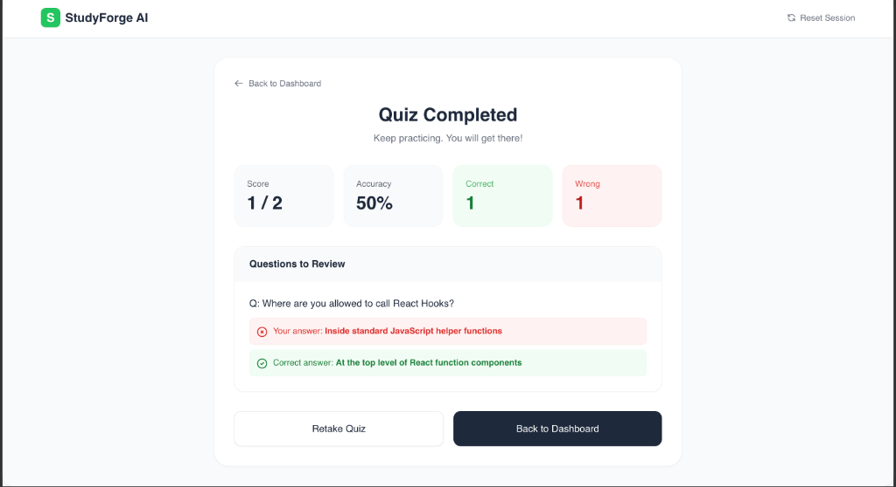
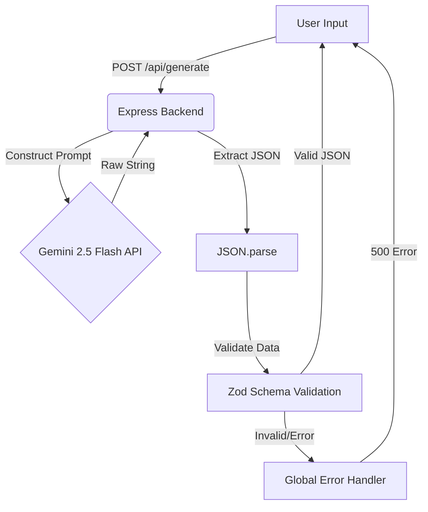

# StudyForge AI

StudyForge AI is a modern, responsive, AI-powered study assistant built as a frontend engineering internship assignment. It takes user study notes or topics and transforms them into interactive Flashcards and a Multiple-Choice Quiz using the Google Gemini 2.5 Flash API.

## Features
- **AI-Powered Generation**: Instantly generate strict, validated JSON flashcards and quizzes from raw text.
- **Interactive Flashcards**: 3D flip animations with keyboard navigation support (Space/Enter).
- **Dynamic Quizzes**: Immediate visual feedback and an automated "Retest Incorrect" loop.
- **Robust Error Handling**: Graceful degradation, AbortControllers to prevent race conditions, and Zod schema validation.
- **Modern SaaS UI**: Minimalist white background, Inter typography, and smooth micro-interactions.

---

## Screenshots & Demo

[🎥 Watch the Video Walkthrough on Google Drive](https://drive.google.com/file/d/1AZphXwOraDt2ngQzJDTfCAoiIqJ8nz7v/view?usp=drive_link)

| Dashboard | Empty State |
|:---:|:---:|
|  |  |

| AI Thinking | Study Material Ready | Flashcard Review |
|:---:|:---:|:---:|
|  |  |  |

| Flashcard Answer | Quiz Question | Quiz Completed |
|:---:|:---:|:---:|
|  |  |  |

---

## Architecture Diagram



---

## Folder Structure
```text
studyforge-ai/
├── client/                  # Vite + React (Frontend)
│   ├── src/
│   │   ├── components/      # Dumb/presentational UI pieces
│   │   ├── hooks/           # Custom state & API logic (useAIRequest)
│   │   ├── services/        # Axios API fetchers
│   │   └── index.css        # Tailwind directives & custom 3D utilities
│   └── package.json
└── server/                  # Node.js + Express (Backend)
    ├── controllers/         # Route logic (generateController)
    ├── middleware/          # Error handlers, rate limiters
    ├── routes/              # Express routers (generate)
    ├── services/            # Gemini API interaction layer
    ├── utils/               # Prompts and helpers
    ├── validators/          # Zod schemas for AI response validation
    └── server.js            # Entry point
```

---

## Setup Instructions

### Prerequisites
- Node.js (v18+ recommended)
- A Google Gemini API Key

### Environment Variables
Create a `.env` file in the `/server` directory:
```env
PORT=5000
GEMINI_API_KEY=your_gemini_api_key_here
```

### Installation
1. Clone the repository.
2. Install frontend dependencies:
   ```bash
   cd client
   npm install
   ```
3. Install backend dependencies:
   ```bash
   cd server
   npm install
   ```

### Running the Application

**Run the Backend (Server)**
```bash
cd server
npm run dev
# Runs on http://localhost:5000
```

**Run the Frontend (Client)**
```bash
cd client
npm run dev
# Runs on http://localhost:5173
```

---

## Known Limitations
- The AI may occasionally return weak or redundant questions depending on the prompt length.
- Internet connection is strictly required for the Gemini API.

---

## Future Improvements (Stretch Goals)
- [x] Local Storage session persistence
- [ ] Dark Mode toggle
- [ ] Export Flashcards as PDF/CSV
- [ ] Markdown support inside Flashcards

## Time Spent
- **Planning & Architecture**: 1 Hour
- **Backend & Validation**: 2 Hours
- **Frontend UI & State**: 3 Hours
- **Documentation & Polish**: 1 Hour
- **Total**: ~7 Hours
